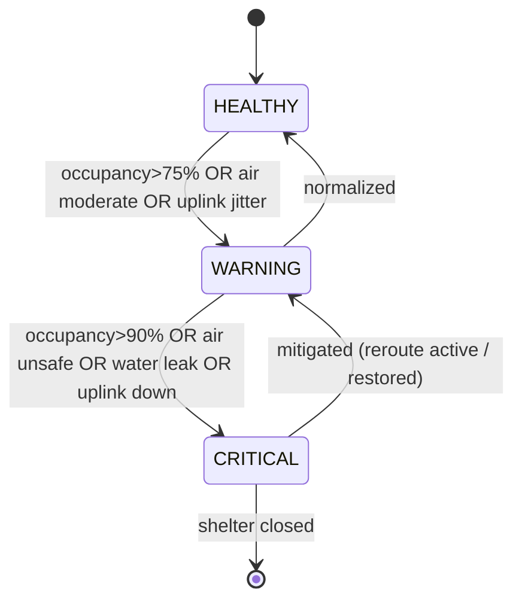

# Aurora

**Live Shelter & Relief-Center Command Center for Resilient Disaster Response**

> *Code With Cisco 2026 — Silver Flag CSR Challenge · Mission: Resilient Disaster Response*  
> *Aurora — light through the storm. One network, one clear view.*

---

## 1. Executive Summary

When a flood, cyclone, or earthquake strikes, the difference between life and death is often **coordination speed**. Relief centers and shelters fill up unevenly, environmental hazards (bad air, rising water, heat) go unnoticed, and connectivity — the backbone of every rescue decision — is the first thing to fail. Today most of this is coordinated over **phone calls and paper registers**, producing stale, error-prone decisions exactly when accuracy matters most.

**Aurora** is a Cisco-powered command center that gives disaster coordinators a **single live picture** of every shelter in an affected zone: how full it is, whether its environment is safe, whether its network is up — and it **acts automatically**, sending Webex alerts and rerouting incoming people to the nearest safe shelter with capacity, *before* a shelter is dangerously overcrowded.

It is built as a **demo-complete vertical slice**: all three application services are connected end-to-end in code (dashboard → API → AI → WebSocket). Cisco client libraries are implemented and callable when credentials are set; **field occupancy/environment for the live demo is driven by a telemetry simulator**, not production Meraki sensors at every shelter.

**Live demo:** https://aurora-csr.vercel.app (dashboard on Vercel; API + AI on AWS EC2 with Duo, Webex, and Meraki configured). See [§8 Live deployment](#8-live-deployment).

---

## 2. The Problem

### 2.1 The real-world pain
During the first 72 hours of a disaster, coordinators must answer three questions continuously — and can't:

1. **"Which shelters have room right now?"** — Occupancy is tracked by hand, radioed in every few hours. By the time a family is directed to a shelter, it may already be full, forcing a dangerous second journey through hazardous conditions.
2. **"Is each shelter actually safe to occupy?"** — A shelter can be structurally intact but have failing air quality (overcrowding, generator fumes), rising water, or dangerous heat. No one is watching these signals in real time.
3. **"Can we even reach the shelter?"** — Relief operations run on connectivity (registrations, medical records, family reunification, supply requests). When a shelter's uplink degrades, the coordination center often finds out only when it goes completely dark.

### 2.2 Why it persists
- **Fragmented data**: occupancy, environment, and network status live in different silos (or nobody's hands).
- **Human-in-the-loop latency**: phone-tree coordination introduces 10–20 minute decision delays per shelter.
- **Reactive, not predictive**: teams respond *after* a shelter is overcrowded or offline, not before.
- **No single source of truth**: field volunteers, shelter managers, and the command center all operate on different, stale snapshots.

### 2.3 Quantified pain (baseline for our impact claims)
| Metric | Typical baseline (manual) | Source of delay |
|---|---|---|
| Shelter-assignment decision time | ~15 minutes | phone calls, manual capacity lookup |
| Time to detect a shelter going over-capacity | 1–3 hours | periodic manual headcounts |
| Time to detect a shelter connectivity outage | 15–45 minutes | noticed only when comms stop |
| Environmental hazard detection | often never | no continuous monitoring |

---

## 3. Target Users

| Persona | Role | What Aurora gives them |
|---|---|---|
| **Disaster Response Coordinator** (primary) | Sits in the emergency operations center (EOC); decides where to send people and resources | A live map + prioritized alert feed; auto-reroute recommendations with reasons |
| **Shelter/Relief-Center Manager** | On the ground running one shelter | Auto-reported occupancy & environment so they stop doing manual headcounts; instant "you're near capacity" warnings |
| **Field Volunteer / First Responder** | Guides evacuees, moves supplies | Reliable "go to Shelter D, it has room and clean air" instructions via Webex |
| **Government / NGO Operations Lead** | Oversees the whole response | Aggregate dashboards, reliability reporting, accountability trail |
| **The evacuee (indirect beneficiary)** | The community member seeking safety | Faster placement in a safe, non-overcrowded shelter; fewer dangerous re-routes |

**Student lens (per the brief):** we chose this because disaster coordination is a problem where a *connected* solution measurably changes the outcome — connectivity and sensing are not decorative, they are the mission.

---

## 4. The Impact

### 4.1 Measurable outcomes (our target claims)
| Outcome | Baseline | With Aurora | How we measure it in the demo |
|---|---|---|---|
| **Shelter-assignment decision time** | ~15 min | **< 30 sec** | timestamp from "capacity query" to "reroute issued" |
| **Over-capacity prevention** | reactive (hours) | **predicted ~15–20 min ahead** | AI forecast fires before the hard cap is hit |
| **Outage detection** | 15–45 min | **seconds** | uplink drop → alert latency shown live |
| **Coordinator situational awareness** | 3 siloed sources | **1 unified live view** | single dashboard demo |

### 4.2 Why it matters (the "so what")
- **Fewer dangerous journeys**: families are sent to the right shelter the first time.
- **Prevents secondary crises**: catching failing air quality or rising water *before* it harms occupants.
- **Reliability where it counts**: the network layer is monitored as a first-class citizen, so comms don't silently fail.
- **Inclusive & scalable**: the same system works for 5 shelters or 500; it is a software layer over Cisco's existing network fabric.

### 4.3 Alignment with the challenge
> *"Keep people, shelters, hospitals, and supplies connected when conditions are unstable."*

Aurora directly delivers the three named sub-capabilities of the Disaster Response mission:
- ✅ **Shelter and relief-center connectivity** (Connect + Observe layers)
- ✅ **Resource and volunteer tracking** (occupancy/capacity + reroute)
- ✅ **Early warning and incident alerts** (Sense + Engage layers)

---

## 5. The Solution

### 5.1 Concept
Aurora is a **real-time command center** with four working parts:

1. **A live sensing/ingestion pipeline** that continuously collects each shelter's *occupancy*, *environment* (air quality, temperature, water-leak), and *network health*.
2. **An observability + anomaly engine** that turns raw signals into states: `HEALTHY → WARNING → CRITICAL`, and detects connectivity degradation.
3. **An explainable AI layer** that forecasts when a shelter will hit capacity and recommends the best alternative shelter for incoming people (nearest, safe, with room).
4. **An action layer** that pushes prioritized alerts and reroute instructions to coordinators over Webex, and secures the whole console behind Duo MFA.

### 5.2 Key features
- **Live shelter map** — every shelter as a color-coded pin (green/amber/red) reflecting combined capacity + environment + network state.
- **Shelter detail cards** — real-time occupancy gauge, air-quality/temp/water sensors, uplink status.
- **Predictive capacity alerts** — "Shelter B will reach capacity in ~18 min at current inflow."
- **Smart reroute engine** — one click (or automatic) → "Redirect intake to Shelter D (2.1 km, 40% full, air OK)."
- **Automated Webex alerts** — critical events posted to a coordinator space with Adaptive Cards + acknowledge buttons.
- **Network-health watch** — shelters whose uplink degrades are flagged before they go dark.
- **Secure access** — Duo MFA in front of the coordinator dashboard.
- **Evacuee Medical ID** — pre-disaster health registry for shelter intake when family is absent:
  - **ID lookup** — coordinator enters evacuee ID or scans QR wristband (`AUR-1001`–`AUR-1004` pre-seeded); API returns blood group, allergies, conditions, medications, emergency contacts.
  - **Face scan** — browser-side `@vladmandic/face-api` captures a 128-dim face embedding; `POST /api/medical/identify` matches against enrolled profiles (Euclidean distance, audit-logged). Requires prior enrollment via the **Register** tab at intake.
  - **Duo-gated** — all `/api/medical/*` routes require coordinator Bearer token; access written to `medical_access_log`.
  - **Production posture** — consent at pre-registration; ID/QR remains primary fallback; face scan is a supplement. Full detail: [MEDICAL_IDENTITY.md](MEDICAL_IDENTITY.md).

### 5.3 The golden-path demo scenario
> A surge of evacuees arrives at **Shelter B**. The **telemetry simulator** (or `demo-golden-path.sh`) drives occupancy and AQI upward. The AI service forecasts a capacity breach; the state engine flips Shelter B to **CRITICAL** and pushes a **Webex Adaptive Card** to the coordinator space. The coordinator logs in via **Duo MFA** at https://aurora-csr.vercel.app, reviews the tactical map, and clicks **AUTHORIZE REROUTE** on the dashboard (primary path). The map and incident feed update live over WebSocket. Optionally, the coordinator can accept reroute from the Webex card if a webhook is configured. **Medical ID** → **ID LOOKUP** → `AUR-1001` (or **FACE SCAN** after enrollment) demonstrates hospital handoff when family is absent.

---

## 6. Cisco Technology Backbone

Aurora maps directly onto Cisco's **Connect → Sense → Observe → Engage → Secure** impact architecture. Each technology is used functionally, not decoratively.

### 6.1 Technology-by-technology

#### 🔗 Connect — **Cisco Meraki (Dashboard API)**
- **Role in Aurora:** Each shelter is mapped to a Meraki network. The API polls the **Meraki Dashboard API** for organization connectivity and uplink status.
- **How it functions:** `meraki.ts` + background poller call uplink endpoints (with India-region fallback); results merge with ingested telemetry in the state engine.
- **PoC status:** **Live API integration** when `MERAKI_API_KEY` and `MERAKI_ORG_ID` are set (e.g. `api.meraki.in`). Uplink telemetry requires claimed MX devices; demo crisis narrative uses the **simulator** for occupancy/AQI.

#### 📡 Sense — **Cisco Spaces + Meraki MT/MV Sensors**
- **Role in Aurora:** Provides the ground-truth signals — **occupancy** (Meraki MV camera people-counting / Cisco Spaces location density) and **environment** (Meraki MT sensors: temperature, humidity, air quality, water-leak).
- **How it functions:** In production, readings would arrive via Meraki sensor API / Cisco Spaces. In this PoC, a **Python simulator** and `POST /api/telemetry` feed realistically shaped occupancy and environment data into the ingestion pipeline.
- **Why Cisco Spaces + Meraki sensors over alternatives:** They reuse the *same network the shelter already runs on* — no separate IoT gateway, no extra SIM/LoRa network to deploy in a crisis. Cisco Spaces turns existing Wi-Fi/cameras into an occupancy sensor without new hardware per person. A generic IoT stack (custom ESP32 + MQTT) would be cheaper per node but is not deployable at disaster speed and gives no unified, secured cloud API. Using Cisco's sensing keeps Sense, Connect, and Secure under one governed umbrella.

#### 👁 Observe — **Cisco ThousandEyes + Splunk**
- **Role in Aurora:** Reliability monitoring and anomaly detection. **ThousandEyes** watches the network path/health to each shelter (latency, loss, outages); **Splunk**-style rules correlate the incoming telemetry to raise `WARNING`/`CRITICAL` states and detect anomalies (e.g., a sudden occupancy spike or an uplink degrading).
- **How it functions:** ThousandEyes API (sandbox/trial) supplies path-visibility and alert data that feeds our network-health view and outage detection; a lightweight rules/anomaly engine (our stand-in for Splunk correlation searches) evaluates thresholds and trends and emits events to the action layer.
- **Why ThousandEyes + Splunk over alternatives:** ThousandEyes provides **end-to-end path visibility across networks it doesn't own** — critical in a disaster where traffic crosses damaged ISP/satellite links; simple ping/uptime checks (e.g., a cron `ping`) can't localize *where* connectivity broke. Splunk is purpose-built for **real-time correlation of heterogeneous telemetry** (sensor + network + app logs) — far better suited than hand-rolled `if` statements or a time-series DB alone for explainable, auditable alerting. Together they answer "is it down, where, and why" in seconds.

#### 💬 Engage — **Cisco Webex (Messages / Bot / Adaptive Cards APIs)**
- **Role in Aurora:** The human action channel. Critical events and reroute recommendations are pushed to a **Webex coordinator space** as rich **Adaptive Cards** with *Accept / Dismiss* buttons; volunteer coordination and support rooms live here too.
- **How it functions:** A **Webex bot** (real, free developer account) posts messages via the Messages API when the engine emits a `CRITICAL` event; Adaptive Card actions post back to our webhook, closing the loop (the coordinator's "Accept reroute" updates the system).
- **Why Webex over alternatives:** Webex offers a **fully-featured, free developer API** with bots, webhooks, and Adaptive Cards, and is already the collaboration tool relief agencies/governments trust for **secure** comms — so alerts land where responders already are. Alternatives (Slack, Twilio SMS, email) either aren't the enterprise/government standard, lack the same secure identity integration with Duo, or (SMS) can't carry interactive acknowledge/act buttons. Webex is also the natural, *first-class* Cisco "Engage" layer the challenge asks for.

#### 🔒 Secure — **Cisco Duo (+ Secure Access / Umbrella narrative)**
- **Role in Aurora:** Protects the coordinator console — only verified responders can view sensitive shelter/occupant data or issue reroutes. **Umbrella** (DNS-layer) and **Secure Access** frame the broader zero-trust posture for field teams.
- **How it functions:** The dashboard login calls **`POST /api/auth/login`**; the API verifies push or passcode via the **Duo Auth API** (server-side, `duo.ts`) and issues a session token used as Bearer on REST and WebSocket. Unauthenticated users cannot reach protected routes.
- **Why Duo over alternatives:** Duo delivers **real MFA in minutes with a generous free tier** and clean web integration — proving the "Secure" layer *for real* rather than as a mention. Rolling our own auth (bcrypt + JWT only) provides no second factor and no device-trust story; a generic OAuth provider (Auth0) isn't part of the Cisco backbone the challenge rewards. Duo also composes naturally with Webex identity, giving a coherent Cisco security story end-to-end.

#### 🧠 Add Intelligence — **Explainable AI layer**
- **Role in Aurora:** Two focused, *explainable* models/heuristics:
  1. **Capacity forecasting** — projects each shelter's occupancy curve from recent inflow to predict time-to-capacity.
  2. **Reroute recommendation** — ranks alternative shelters by a transparent score = f(distance, available capacity, environmental safety, network health).
- **How it functions:** Runs in the backend on the live telemetry; every recommendation ships with a **human-readable reason** ("Shelter D: 2.1 km, 40% full, air OK, uplink healthy") so coordinators trust and can override it.
- **Why this approach:** The challenge explicitly says *"keep it explainable and tied to your POC."* We deliberately avoid a black-box model; a lightweight forecast + weighted scoring is accurate enough for the PoC, fast, and fully auditable — which matters when the output moves human beings during an emergency.

### 6.2 Layer → technology → function summary

| Layer | Cisco technology | Function in Aurora | Integration status (current build) |
|---|---|---|---|
| **Connect** | Meraki Dashboard API | Shelter network mapping + uplink polling | **Live API** when configured; uplinks empty without MX hardware |
| **Sense** | Meraki MT/MV + Cisco Spaces (roadmap) | Occupancy + environment | **Simulator** + `/api/telemetry` for demo |
| **Observe** | ThousandEyes + rules engine | Path probe + threshold correlation | TE **health probe**; rules engine **live** in `state.ts` (not Splunk SIEM) |
| **Engage** | Webex Bot + Adaptive Cards | CRITICAL alerts + optional card actions | **Live** when `WEBEX_*` set |
| **Secure** | Duo Auth API | MFA-gated console + medical APIs | **Live** when `DUO_*` set |
| **Intelligence** | Explainable AI (FastAPI) | Forecast + reroute scoring | **Live** Python service on :8001 |

### 6.3 Application integration status

All internal services are **connected in the running PoC** — this is not a mock UI-only submission.

| Link | Status | How to verify |
|------|--------|---------------|
| Dashboard → API (REST) | ✅ Wired | Login, shelters, reroute, medical routes |
| Dashboard → API (WebSocket) | ✅ Wired | Map/cards update without refresh |
| API → AI service (:8001) | ✅ Wired | `/api/health` → `"ai": "connected"` |
| API → Duo | ✅ When configured | `/api/health` → `"auth": "duo"` |
| API → Webex | ✅ When configured | CRITICAL event posts Adaptive Card |
| API → Meraki | ✅ When configured | `/api/health` → `cisco.meraki: true` |
| Simulator → API | ✅ Wired | `demo-golden-path.sh` or `run_golden_path.py` |
| Cisco Spaces | ❌ Not implemented | No tenant/license — wiring in §6.4 |
| Splunk export | ❌ Not implemented | No Splunk Cloud — HEC wiring in §6.4 |

**Honest framing for judges:** Aurora proves a **working vertical slice** with real Cisco API clients (Duo, Webex, Meraki) and a **deterministic simulator** for field telemetry — not a fully deployed sensor network at every shelter.

### 6.4 Deferred integrations: Cisco Spaces & Splunk

Two Observe/Sense technologies appear in our architecture diagrams and Cisco narrative but are **intentionally not coded** in this PoC.

#### Why they are not implemented

| Technology | Blocker | PoC substitute |
|------------|---------|------------------|
| **Cisco Spaces** | No **Spaces tenant or license** available to the team; Spaces requires partner-enabled Meraki/Catalyst deployment and configured location zones — beyond our Meraki Dashboard API (Connect) access. | Telemetry **simulator** + `POST /api/telemetry` |
| **Splunk** | No **Splunk Cloud** or Enterprise instance with **HTTP Event Collector (HEC)** provisioned for this project. | In-process **rules engine** (`engine/state.ts`, `services/telemetry.ts`) |

We chose not to ship stub/mock clients that pretend to call these APIs. Judges can verify real integrations via `/api/health` (Duo, Meraki, Webex) while understanding exactly what is deferred and why.

#### How Cisco Spaces would wire in

Spaces is the **Sense** layer source for **occupancy and location density** (Wi-Fi/camera-derived counts at each shelter zone).

```
Cisco Spaces API / Firehose
        │
        ▼
  spacesPoller.ts  (or POST /api/webhooks/spaces)
        │  map zoneId → shelterId
        ▼
  processTelemetry()  ← existing pipeline
        │
        ├──► SQLite (telemetry table)
        ├──► state engine → HEALTHY | WARNING | CRITICAL
        └──► WebSocket + Webex (unchanged)
```

**Implementation checklist (when a tenant exists):**

1. **`services/api/src/cisco/spaces.ts`** — authenticate (OAuth/API key per Spaces docs); fetch location analytics or subscribe to notifications.
2. **Shelter mapping** — extend shelter config with `spacesZoneId` (alongside `merakiNetworkId`).
3. **Poller or webhook** — `jobs/spacesPoller.ts` on an interval, or push endpoint for Firehose events.
4. **Normalize to `TelemetryInput`** — occupancy count → `occupancy` / `capacity`; optional presence density for trend features.
5. **No dashboard changes** — map, cards, and AI forecast already consume unified shelter telemetry.

#### How Splunk would wire in

Splunk is the **Observe** layer **system of record** for correlation, search, and compliance — complementing Aurora’s real-time WebSocket path.

```
telemetry ingest / state change / alert / reroute / audit
        │
        ▼
  splunkHec.ts  →  POST /services/collector/event
        │
        ▼
  Splunk Cloud (index: aurora)
        │
        ├──► SPL correlation searches (multi-signal alerts)
        ├──► Dashboards for NGO / government ops leads
        └──► Optional: modular alert → Webex
```

**Implementation checklist (when Splunk Cloud exists):**

1. **Env vars** — `SPLUNK_HEC_URL`, `SPLUNK_HEC_TOKEN`, `SPLUNK_INDEX=aurora`.
2. **`services/api/src/observe/splunkHec.ts`** — fire-and-forget HEC posts with structured JSON (`sourcetype`, `event`, `fields`).
3. **Hook points (already centralized):**
   - `insertTelemetry()` — every sensor reading
   - `maybeCreateCriticalAlert()` — CRITICAL events with reroute metadata
   - `acceptReroute()` — coordinator action audit
   - `logMedicalAccess()` — optional PHI-adjacent audit stream (separate index in production)
4. **Splunk SPL** — replace or duplicate rules in `computeShelterState()` as scheduled/real-time searches across `aurora:telemetry`.
5. **Division of labour** — keep Aurora rules engine for **sub-second** WebSocket + Webex; Splunk for **cross-shelter analytics**, historical replay, and regulatory audit.

See also [docs/ADR.md §9](ADR.md#9-deferred-cisco-spaces-and-splunk-integrations).

---

## 7. Architecture

### 7.1 Layered system architecture


### 7.2 End-to-end data flow (the golden path)

```mermaid
sequenceDiagram
    autonumber
    participant SEN as 📡 Simulator / telemetry
    participant ING as ⚙️ Ingestion
    participant ST as State Engine
    participant AN as Anomaly Engine
    participant AI as 🧠 AI Layer
    participant WX as 💬 Webex
    participant CO as 🖥️ Coordinator
    participant MAP as Live Map

    SEN->>ING: occupancy=182/200, air=degrading
    ING->>ST: update Shelter B telemetry
    ST->>MAP: push state (amber→red)
    ST->>AN: evaluate thresholds/trends
    AN->>AI: occupancy trend + inflow rate
    AI-->>AN: "capacity in ~18 min; reroute → Shelter D"
    AN->>WX: CRITICAL alert + Adaptive Card
    WX-->>CO: notification in Webex space
    CO->>MAP: AUTHORIZE REROUTE (primary)
    ING->>MAP: WebSocket — reroute active
    Note over MAP,CO: Optional: Accept on Webex card via webhook
```

### 7.3 Shelter state model



### 7.4 Core data model (PoC)

```
Shelter        { id, name, lat, lng, capacity, currentOccupancy,
                 state: HEALTHY|WARNING|CRITICAL, merakiNetworkId }
Telemetry      { shelterId, ts, occupancy, airQuality, temperature,
                 humidity, waterLeak: bool, uplinkStatus, latencyMs, lossPct }
Event/Alert    { id, shelterId, ts, severity, type, message,
                 recommendation, ackedBy, status }
RerouteRec     { fromShelterId, toShelterId, score, reasons[], etaMin }
User           { id, name, role, duoVerified }
```

### 7.5 Tech stack (implemented)

| Concern | Choice | Location |
|---|---|---|
| Frontend | **React 18 + TypeScript + Vite**, Leaflet map, custom CSS, `@vladmandic/face-api` | `apps/dashboard` |
| Realtime | **Native WebSocket** (`ws`) — `/ws/live` | `services/api/src/ws/` |
| API | **Node.js 20 + Express**, better-sqlite3 | `services/api` |
| AI | **Python 3.12 + FastAPI**, pytest | `services/ai` |
| Data | **SQLite** (shelters, telemetry, events, medical) | `services/api/src/db/` |
| Cisco clients | Meraki REST, Webex Messages API, Duo Auth API, ThousandEyes probe | `services/api/src/cisco/` |
| Demo driver | Python simulator + `scripts/demo-golden-path.sh` | `services/ai/simulator/`, `scripts/` |
| Container | Docker Compose (API + AI + nginx dashboard) | `docker-compose.yml` |

**Not in this build:** Tailwind, Socket.IO, Postgres, Cisco Spaces API, Splunk SIEM export, Umbrella/Secure Access (narrative only).

---

## 8. Live deployment

Aurora is **deployed and reachable** for hackathon review — not localhost-only.

### 8.1 Architecture

```
┌─────────────────────────┐     HTTPS / WSS      ┌──────────────────────────────────┐
│  Vercel                 │ ───────────────────► │  AWS EC2 (us-east-1)             │
│  aurora-csr.vercel.app  │                      │  Docker: API :8000 + AI :8001    │
│  React dashboard        │                      │  Caddy → Let's Encrypt (sslip.io)│
└─────────────────────────┘                      └──────────────────────────────────┘
```

| Endpoint | URL |
|----------|-----|
| **Dashboard (primary)** | https://aurora-csr.vercel.app |
| **API base** | https://52-86-46-38.sslip.io |
| **WebSocket** | `wss://52-86-46-38.sslip.io/ws/live` |
| **Health check** | https://52-86-46-38.sslip.io/api/health |

Vercel env (baked at build): `VITE_API_URL`, `VITE_WS_URL` → EC2 HTTPS host. Backend env (EC2): Duo, Webex, Meraki from `services/api/.env`.

### 8.2 Production integration status

Verified against the cloud API (`/api/health`):

| Integration | Cloud status | Notes |
|-------------|--------------|-------|
| Duo MFA | ✅ Live | `"auth": "duo"` |
| Webex | ✅ Configured | Adaptive Cards on CRITICAL |
| Meraki Dashboard API | ✅ Live | Org + shelter networks mapped |
| AI service | ✅ Connected | FastAPI on same EC2 host |
| WebSocket | ✅ Live | Map/cards/feed push |
| Field telemetry | 🟡 Simulator | `demo-golden-path.sh` → cloud API |
| Medical ID | ✅ Live | ID lookup + face scan on deployed dashboard |

### 8.3 Demo walkthrough (cloud)

1. Open https://aurora-csr.vercel.app → Duo login as coordinator.
2. Confirm login status: *SECURE CHANNEL READY · DUO MFA REQUIRED*.
3. Run `./scripts/demo-golden-path.sh` locally (targets EC2 if `API_URL` set) or use **SIMULATE CRISIS** if exposed — Shelter B → CRITICAL → reroute.
4. Click **MEDICAL ID** → **ID LOOKUP** → `AUR-1001` (Priya Sharma — allergies highlighted).
5. Optional: **REGISTER** → capture face for `AUR-1001` → **FACE SCAN** → **CAPTURE & IDENTIFY**.

### 8.4 Ops scripts

| Script | Purpose |
|--------|---------|
| `scripts/provision-ec2-backend.sh` | One-time EC2 + Elastic IP + security group |
| `scripts/deploy-ec2-backend.sh` | Sync repo + rebuild Docker on EC2 |
| `scripts/configure-vercel-backend.sh` | Set Vercel env vars + production redeploy |

Repo: https://github.com/SuyashAlphaC/Aurora · Deploy guide: [VERCEL_DEPLOY.md](VERCEL_DEPLOY.md)
