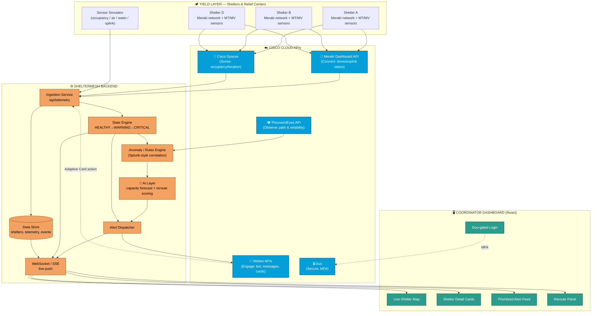
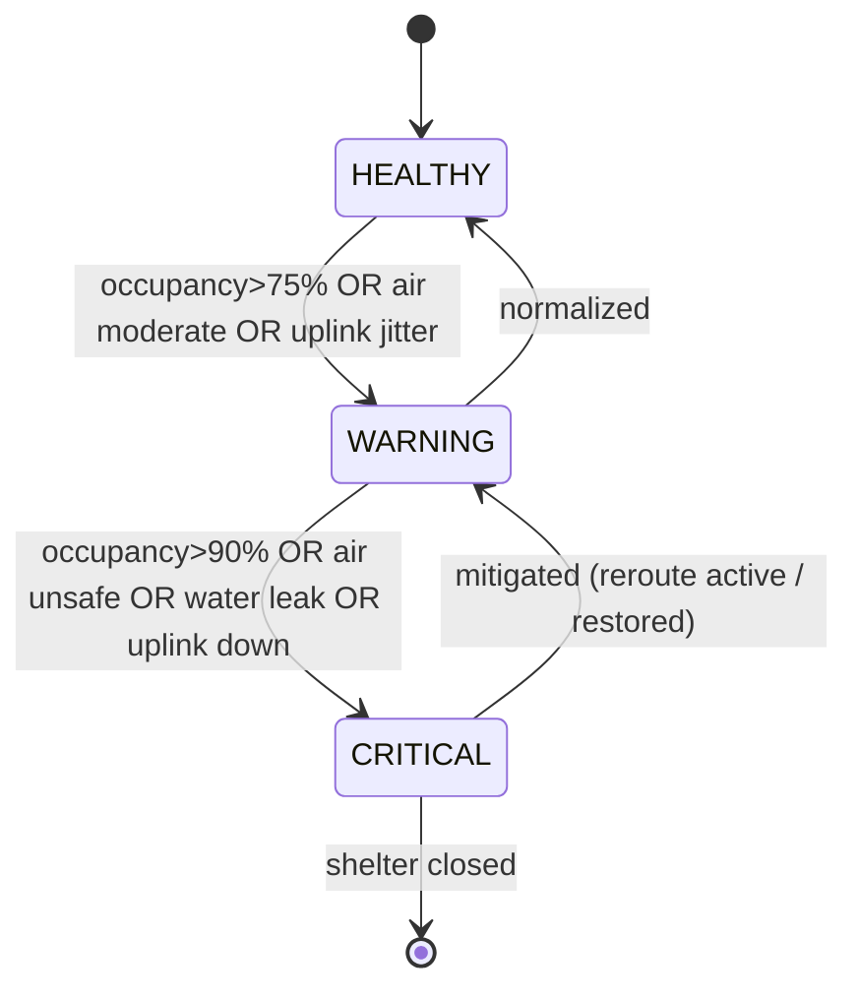

# Aurora

**Live Shelter & Relief-Center Command Center for Resilient Disaster Response**

> *Code With Cisco 2026 — Silver Flag CSR Challenge · Mission: Resilient Disaster Response*  
> *Aurora — light through the storm. One network, one clear view.*

---

## 1. Executive Summary

When a flood, cyclone, or earthquake strikes, the difference between life and death is often **coordination speed**. Relief centers and shelters fill up unevenly, environmental hazards (bad air, rising water, heat) go unnoticed, and connectivity — the backbone of every rescue decision — is the first thing to fail. Today most of this is coordinated over **phone calls and paper registers**, producing stale, error-prone decisions exactly when accuracy matters most.

**Aurora** is a Cisco-powered command center that gives disaster coordinators a **single live picture** of every shelter in an affected zone: how full it is, whether its environment is safe, whether its network is up — and it **acts automatically**, sending Webex alerts and rerouting incoming people to the nearest safe shelter with capacity, *before* a shelter is dangerously overcrowded.

It is built as a **demo-complete vertical slice** on Cisco's connectivity, sensing, observability, engagement, and security stack, with an explainable AI layer for capacity forecasting and reroute recommendations.

---

## 2. The Problem

### 2.1 The real-world pain
During the first 72 hours of a disaster, coordinators must answer three questions continuously — and can't:

1. **"Which shelters have room right now?"** — Occupancy is tracked by hand, radioed in every few hours. By the time a family is directed to a shelter, it may already be full, forcing a dangerous second journey through hazardous conditions.
2. **"Is each shelter actually safe to occupy?"** — A shelter can be structurally intact but have failing air quality (overcrowding, generator fumes), rising water, or dangerous heat. No one is watching these signals in real time.
3. **"Can we even reach the shelter?"** — Relief operations run on connectivity (registrations, medical records, family reunification, supply requests). When a shelter's uplink degrades, the coordination center often finds out only when it goes completely dark.

### 2.2 Why it persists
- **Fragmented data**: occupancy, environment, and network status live in different silos (or nobody's hands).
- **Human-in-the-loop latency**: phone-tree coordination introduces 10–20 minute decision delays per shelter.
- **Reactive, not predictive**: teams respond *after* a shelter is overcrowded or offline, not before.
- **No single source of truth**: field volunteers, shelter managers, and the command center all operate on different, stale snapshots.

### 2.3 Quantified pain (baseline for our impact claims)
| Metric | Typical baseline (manual) | Source of delay |
|---|---|---|
| Shelter-assignment decision time | ~15 minutes | phone calls, manual capacity lookup |
| Time to detect a shelter going over-capacity | 1–3 hours | periodic manual headcounts |
| Time to detect a shelter connectivity outage | 15–45 minutes | noticed only when comms stop |
| Environmental hazard detection | often never | no continuous monitoring |

---

## 3. Target Users

| Persona | Role | What Aurora gives them |
|---|---|---|
| **Disaster Response Coordinator** (primary) | Sits in the emergency operations center (EOC); decides where to send people and resources | A live map + prioritized alert feed; auto-reroute recommendations with reasons |
| **Shelter/Relief-Center Manager** | On the ground running one shelter | Auto-reported occupancy & environment so they stop doing manual headcounts; instant "you're near capacity" warnings |
| **Field Volunteer / First Responder** | Guides evacuees, moves supplies | Reliable "go to Shelter D, it has room and clean air" instructions via Webex |
| **Government / NGO Operations Lead** | Oversees the whole response | Aggregate dashboards, reliability reporting, accountability trail |
| **The evacuee (indirect beneficiary)** | The community member seeking safety | Faster placement in a safe, non-overcrowded shelter; fewer dangerous re-routes |

**Student lens (per the brief):** we chose this because disaster coordination is a problem where a *connected* solution measurably changes the outcome — connectivity and sensing are not decorative, they are the mission.

---

## 4. The Impact

### 4.1 Measurable outcomes (our target claims)
| Outcome | Baseline | With Aurora | How we measure it in the demo |
|---|---|---|---|
| **Shelter-assignment decision time** | ~15 min | **< 30 sec** | timestamp from "capacity query" to "reroute issued" |
| **Over-capacity prevention** | reactive (hours) | **predicted ~15–20 min ahead** | AI forecast fires before the hard cap is hit |
| **Outage detection** | 15–45 min | **seconds** | uplink drop → alert latency shown live |
| **Coordinator situational awareness** | 3 siloed sources | **1 unified live view** | single dashboard demo |

### 4.2 Why it matters (the "so what")
- **Fewer dangerous journeys**: families are sent to the right shelter the first time.
- **Prevents secondary crises**: catching failing air quality or rising water *before* it harms occupants.
- **Reliability where it counts**: the network layer is monitored as a first-class citizen, so comms don't silently fail.
- **Inclusive & scalable**: the same system works for 5 shelters or 500; it is a software layer over Cisco's existing network fabric.

### 4.3 Alignment with the challenge
> *"Keep people, shelters, hospitals, and supplies connected when conditions are unstable."*

Aurora directly delivers the three named sub-capabilities of the Disaster Response mission:
- ✅ **Shelter and relief-center connectivity** (Connect + Observe layers)
- ✅ **Resource and volunteer tracking** (occupancy/capacity + reroute)
- ✅ **Early warning and incident alerts** (Sense + Engage layers)

---

## 5. The Solution

### 5.1 Concept
Aurora is a **real-time command center** with four working parts:

1. **A live sensing/ingestion pipeline** that continuously collects each shelter's *occupancy*, *environment* (air quality, temperature, water-leak), and *network health*.
2. **An observability + anomaly engine** that turns raw signals into states: `HEALTHY → WARNING → CRITICAL`, and detects connectivity degradation.
3. **An explainable AI layer** that forecasts when a shelter will hit capacity and recommends the best alternative shelter for incoming people (nearest, safe, with room).
4. **An action layer** that pushes prioritized alerts and reroute instructions to coordinators over Webex, and secures the whole console behind Duo MFA.

### 5.2 Key features
- **Live shelter map** — every shelter as a color-coded pin (green/amber/red) reflecting combined capacity + environment + network state.
- **Shelter detail cards** — real-time occupancy gauge, air-quality/temp/water sensors, uplink status.
- **Predictive capacity alerts** — "Shelter B will reach capacity in ~18 min at current inflow."
- **Smart reroute engine** — one click (or automatic) → "Redirect intake to Shelter D (2.1 km, 40% full, air OK)."
- **Automated Webex alerts** — critical events posted to a coordinator space with Adaptive Cards + acknowledge buttons.
- **Network-health watch** — shelters whose uplink degrades are flagged before they go dark.
- **Secure access** — Duo MFA in front of the coordinator dashboard.

### 5.3 The golden-path demo scenario
> A surge of evacuees arrives at **Shelter B**. The occupancy sensor climbs; the AI forecasts it will exceed capacity in ~18 minutes and air quality begins to degrade. Aurora flips Shelter B to **CRITICAL**, fires a **Webex alert** to the coordinator space, and recommends rerouting intake to **Shelter D** (nearest with room and safe air). The coordinator taps *Accept* on the Webex Adaptive Card; the map updates the intake routing. Moments later a **network uplink** at Shelter A degrades — ThousandEyes/Meraki data flags it and Aurora pages the NOC team, all in seconds.

---

## 6. Cisco Technology Backbone

Aurora maps directly onto Cisco's **Connect → Sense → Observe → Engage → Secure** impact architecture. Each technology is used functionally, not decoratively.

### 6.1 Technology-by-technology

#### 🔗 Connect — **Cisco Meraki (Dashboard API)**
- **Role in Aurora:** Each shelter is modeled as a Meraki *network/site*. We pull real device and uplink status from the **Meraki Dashboard API** (via the always-on Cisco DevNet sandbox) to know whether a shelter's connectivity backbone is healthy.
- **How it functions:** Backend polls `GET /organizations/{id}/devices/statuses` and uplink endpoints on an interval; results feed the shelter's `network` health field and drive the map color and outage alerts.
- **Why Meraki over alternatives:** Meraki is *cloud-managed*, so its entire state is available through a clean REST API with **no on-prem controller** — ideal for a disaster where local infrastructure is compromised and everything must be managed centrally. Alternatives (raw SNMP polling, on-prem Catalyst-only management, or a generic MQTT broker) would require infrastructure that doesn't survive a disaster and lack a unified cloud API. Meraki also natively hosts the environmental sensors we need (see Sense), giving one vendor API for both connectivity *and* sensing.

#### 📡 Sense — **Cisco Spaces + Meraki MT/MV Sensors**
- **Role in Aurora:** Provides the ground-truth signals — **occupancy** (Meraki MV camera people-counting / Cisco Spaces location density) and **environment** (Meraki MT sensors: temperature, humidity, air quality, water-leak).
- **How it functions:** Sensor readings arrive via the Meraki sensor API / Cisco Spaces; in the PoC a **sensor simulator** produces realistically-shaped data (and pulls live values from the Meraki sandbox where available) into our ingestion endpoint. These readings set each shelter's `occupancy` and `environment` state.
- **Why Cisco Spaces + Meraki sensors over alternatives:** They reuse the *same network the shelter already runs on* — no separate IoT gateway, no extra SIM/LoRa network to deploy in a crisis. Cisco Spaces turns existing Wi-Fi/cameras into an occupancy sensor without new hardware per person. A generic IoT stack (custom ESP32 + MQTT) would be cheaper per node but is not deployable at disaster speed and gives no unified, secured cloud API. Using Cisco's sensing keeps Sense, Connect, and Secure under one governed umbrella.

#### 👁 Observe — **Cisco ThousandEyes + Splunk**
- **Role in Aurora:** Reliability monitoring and anomaly detection. **ThousandEyes** watches the network path/health to each shelter (latency, loss, outages); **Splunk**-style rules correlate the incoming telemetry to raise `WARNING`/`CRITICAL` states and detect anomalies (e.g., a sudden occupancy spike or an uplink degrading).
- **How it functions:** ThousandEyes API (sandbox/trial) supplies path-visibility and alert data that feeds our network-health view and outage detection; a lightweight rules/anomaly engine (our stand-in for Splunk correlation searches) evaluates thresholds and trends and emits events to the action layer.
- **Why ThousandEyes + Splunk over alternatives:** ThousandEyes provides **end-to-end path visibility across networks it doesn't own** — critical in a disaster where traffic crosses damaged ISP/satellite links; simple ping/uptime checks (e.g., a cron `ping`) can't localize *where* connectivity broke. Splunk is purpose-built for **real-time correlation of heterogeneous telemetry** (sensor + network + app logs) — far better suited than hand-rolled `if` statements or a time-series DB alone for explainable, auditable alerting. Together they answer "is it down, where, and why" in seconds.

#### 💬 Engage — **Cisco Webex (Messages / Bot / Adaptive Cards APIs)**
- **Role in Aurora:** The human action channel. Critical events and reroute recommendations are pushed to a **Webex coordinator space** as rich **Adaptive Cards** with *Accept / Dismiss* buttons; volunteer coordination and support rooms live here too.
- **How it functions:** A **Webex bot** (real, free developer account) posts messages via the Messages API when the engine emits a `CRITICAL` event; Adaptive Card actions post back to our webhook, closing the loop (the coordinator's "Accept reroute" updates the system).
- **Why Webex over alternatives:** Webex offers a **fully-featured, free developer API** with bots, webhooks, and Adaptive Cards, and is already the collaboration tool relief agencies/governments trust for **secure** comms — so alerts land where responders already are. Alternatives (Slack, Twilio SMS, email) either aren't the enterprise/government standard, lack the same secure identity integration with Duo, or (SMS) can't carry interactive acknowledge/act buttons. Webex is also the natural, *first-class* Cisco "Engage" layer the challenge asks for.

#### 🔒 Secure — **Cisco Duo (+ Secure Access / Umbrella narrative)**
- **Role in Aurora:** Protects the coordinator console — only verified responders can view sensitive shelter/occupant data or issue reroutes. **Umbrella** (DNS-layer) and **Secure Access** frame the broader zero-trust posture for field teams.
- **How it functions:** The dashboard login is gated by **Duo MFA** (free tier, real integration) via Duo's Web SDK / OIDC; unauthenticated users can't reach the live data or action APIs.
- **Why Duo over alternatives:** Duo delivers **real MFA in minutes with a generous free tier** and clean web integration — proving the "Secure" layer *for real* rather than as a mention. Rolling our own auth (bcrypt + JWT only) provides no second factor and no device-trust story; a generic OAuth provider (Auth0) isn't part of the Cisco backbone the challenge rewards. Duo also composes naturally with Webex identity, giving a coherent Cisco security story end-to-end.

#### 🧠 Add Intelligence — **Explainable AI layer**
- **Role in Aurora:** Two focused, *explainable* models/heuristics:
  1. **Capacity forecasting** — projects each shelter's occupancy curve from recent inflow to predict time-to-capacity.
  2. **Reroute recommendation** — ranks alternative shelters by a transparent score = f(distance, available capacity, environmental safety, network health).
- **How it functions:** Runs in the backend on the live telemetry; every recommendation ships with a **human-readable reason** ("Shelter D: 2.1 km, 40% full, air OK, uplink healthy") so coordinators trust and can override it.
- **Why this approach:** The challenge explicitly says *"keep it explainable and tied to your POC."* We deliberately avoid a black-box model; a lightweight forecast + weighted scoring is accurate enough for the PoC, fast, and fully auditable — which matters when the output moves human beings during an emergency.

### 6.2 Layer → technology → function summary

| Layer | Cisco technology | Function in Aurora | Real vs. simulated in PoC |
|---|---|---|---|
| **Connect** | Meraki Dashboard API | Shelter site/uplink connectivity status | **Real** (DevNet sandbox) |
| **Sense** | Cisco Spaces + Meraki MT/MV | Occupancy + environment (air/temp/water) | Real where sandbox allows + **simulator** |
| **Observe** | ThousandEyes + Splunk | Path/reliability monitoring, anomaly detection, alerting | **Real** TE (sandbox/trial) + rules engine for Splunk |
| **Engage** | Webex (Bot/Messages/Adaptive Cards) | Push alerts, reroute cards, coordination | **Real** (free dev account) |
| **Secure** | Duo (+ Umbrella/Secure Access) | MFA-gated coordinator console; zero-trust framing | **Real** Duo (free tier) |
| **Intelligence** | Explainable AI (forecast + scoring) | Predict capacity, recommend reroute with reasons | **Real** (synthetic training data) |

---

## 7. Architecture

### 7.1 Layered system architecture



### 7.2 End-to-end data flow (the golden path)

```mermaid
sequenceDiagram
    autonumber
    participant SEN as 📡 Sensor/Meraki (Shelter B)
    participant ING as ⚙️ Ingestion
    participant ST as State Engine
    participant AN as Anomaly Engine
    participant AI as 🧠 AI Layer
    participant WX as 💬 Webex
    participant CO as 🖥️ Coordinator
    participant MAP as Live Map

    SEN->>ING: occupancy=182/200, air=degrading
    ING->>ST: update Shelter B telemetry
    ST->>MAP: push state (amber→red)
    ST->>AN: evaluate thresholds/trends
    AN->>AI: occupancy trend + inflow rate
    AI-->>AN: "capacity in ~18 min; reroute → Shelter D"
    AN->>WX: CRITICAL alert + Adaptive Card (Accept/Dismiss)
    WX-->>CO: coordinator sees card in Webex space
    CO->>WX: taps "Accept reroute"
    WX->>ING: webhook: reroute accepted
    ING->>MAP: intake now routed to Shelter D
    Note over MAP,CO: Decision time < 30s vs ~15 min manual
```

### 7.3 Shelter state model



### 7.4 Core data model (PoC)

```
Shelter        { id, name, lat, lng, capacity, currentOccupancy,
                 state: HEALTHY|WARNING|CRITICAL, merakiNetworkId }
Telemetry      { shelterId, ts, occupancy, airQuality, temperature,
                 humidity, waterLeak: bool, uplinkStatus, latencyMs, lossPct }
Event/Alert    { id, shelterId, ts, severity, type, message,
                 recommendation, ackedBy, status }
RerouteRec     { fromShelterId, toShelterId, score, reasons[], etaMin }
User           { id, name, role, duoVerified }
```

### 7.5 Proposed tech stack (for the build phase)
| Concern | Choice | Rationale |
|---|---|---|
| Frontend | **React + Vite + Tailwind**, map via Leaflet/Mapbox | fast, demo-polished, live map out of the box |
| Realtime | **WebSocket (Socket.IO)** or SSE | live map/alerts without refresh |
| Backend | **Node.js + Express** (or FastAPI if team prefers Python) | quickest path to Webex/Meraki/Duo SDKs |
| Data | **SQLite/Postgres** + in-memory cache | lightweight, enough for PoC |
| AI | Python microservice **or** JS heuristic module | explainable forecast + weighted scoring |
| Cisco SDKs | Meraki Dashboard API, Webex SDK, Duo Web SDK, ThousandEyes API | the real integrations |
| Simulator | small Node/Python script | drives the live demo deterministically |

> Final stack is confirmed at the start of the build phase based on team strengths (mixed team → React + Node keeps one language across FE/BE, with an optional small Python AI service).

---

## 8. Scope for the 11-Day Sprint

**In scope (demo-complete vertical slice):** live dashboard + map, real Meraki-sandbox connectivity data, sensor simulator feeding occupancy/environment, state + anomaly engine, explainable AI forecast + reroute, **real Webex alerts**, **real Duo MFA**, one rock-solid golden-path demo.

**Out of scope (correctly):** physical hardware, production deployment/scale, full user management, mobile apps, exhaustive edge-case handling, historical data warehouse.

**Guiding principle:** *demo depth over feature breadth* — one flawless connected scenario beats twenty half-working features.

---

## 9. Deliverables (per the challenge brief)

| # | Deliverable | Status |
|---|-------------|--------|
| 1 | 3-slide pitch deck | ✅ `docs/PITCH_DECK.md`, `docs/pitch/index.html` |
| 2 | 5-minute recorded team pitch | ⬜ Team to record |
| 3 | Short recorded PoC demo | ⬜ Team to record — script in `docs/SUBMISSION.md` |
| 4 | GitHub repository | ✅ https://github.com/SuyashAlphaC/Aurora |

See **`docs/SUBMISSION.md`** for judge demo script, Cisco honesty matrix, and checklist.

### Phase 2 extensions (built in PoC)

- **Evacuee Medical Identity** — pre-registered health profiles via ID lookup or face scan (`docs/MEDICAL_IDENTITY.md`)
- **Tactical EOC UI** — disaster command-center dashboard with SEC-01–SEC-05 panels
