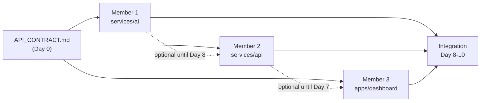

# Aurora — 3-Member Work Distribution

**Goal:** Three people build in parallel for ~11 days, merge into **one GitHub repo**, and demo a connected golden path on **13 Jul**.

**Strategy:** Contract-first monorepo. Everyone codes against `docs/API_CONTRACT.md` + local mocks until integration week.

---

## Team roles (recommended)

| Member | Codename | Primary ownership | Why this fit |
|---|---|---|---|
| **Member 1** | `@ml` | AI + sensor simulator | ML/DL strength → capacity forecast, reroute scoring, explainability, demo data generation |
| **Member 2** | `@backend` | Core API + Cisco integrations | Flexible dev → owns the hub that wires Meraki, Webex, Duo, ThousandEyes, WebSocket |
| **Member 3** | `@frontend` | Coordinator dashboard UI | Flexible dev → map, live cards, alert feed, Duo login shell, demo polish |

> Names are placeholders — replace with real GitHub handles in `CODEOWNERS`.

---

## Repo layout (each member owns a folder)

```
Aurora/
├── docs/                    # shared — all read, no exclusive owner
│   ├── PROJECT.md
│   ├── API_CONTRACT.md      # 🔒 integration contract (Day 0 freeze)
│   └── WORK_DISTRIBUTION.md
├── packages/
│   └── shared-types/        # optional Day 2 — JSON schemas / TS types (anyone)
├── services/
│   ├── ai/                  # 👤 Member 1 ONLY
│   └── api/                 # 👤 Member 2 ONLY
├── apps/
│   └── dashboard/           # 👤 Member 3 ONLY
├── scripts/
│   └── demo-golden-path.sh  # joint — Member 2 leads, all contribute
└── docker-compose.yml       # Member 2 owns, others review
```

**Rule:** Do not edit another member's top-level folder without a PR + review from that owner.

---

## Dependency graph (who waits on whom)



**Key:** Nobody blocks until **Day 8**. Before that, each member ships against mocks.

---

## Member 1 — AI + Sensor Simulator (`services/ai/`)

### Mission
Build the **explainable intelligence layer** and the **deterministic demo data generator** that drives the golden-path scenario.

### Owns
| Deliverable | Path | Done when |
|---|---|---|
| Capacity forecasting API | `services/ai/app/forecast.py` | Returns `minutesToCapacity` + confidence from telemetry window |
| Reroute scoring API | `services/ai/app/reroute.py` | Returns ranked shelters with **human-readable reasons** |
| Explainability module | `services/ai/app/explain.py` | Every recommendation includes reason strings |
| Sensor simulator | `services/ai/simulator/` | Script replays Shelter B surge scenario on a schedule |
| AI service HTTP server | `services/ai/main.py` | FastAPI on `:8001` per contract |
| AI unit tests | `services/ai/tests/` | Forecast + reroute happy paths |
| AI README | `services/ai/README.md` | How to run standalone |

### Does NOT own
- Webex, Meraki, Duo (Member 2)
- React UI (Member 3)
- Main REST `/api/*` routes (Member 2 proxies to you)

### Standalone workflow (Days 1–7)
```bash
cd services/ai
python -m venv .venv && source .venv/bin/activate
pip install -r requirements.txt
uvicorn main:app --reload --port 8001
# POST /ai/forecast and /ai/reroute with sample payloads from API_CONTRACT.md
python simulator/run_golden_path.py   # drives scripted surge
```

### Mock strategy
- Ship `services/ai/fixtures/sample_telemetry.json` — 30 min of Shelter B filling up
- Member 2 can call your real service OR drop in `services/ai/mocks/` responses until Day 8

### Acceptance criteria
- [ ] Forecast predicts Shelter B full in ~15–20 min when inflow is high
- [ ] Reroute always picks Shelter D over full/unhealthy shelters
- [ ] Every response includes `reasons: string[]`
- [ ] Simulator can run headless for recorded demo
- [ ] README documents curl examples matching contract

### Suggested ML approach (keep scope tight)
- **Forecast:** rolling linear regression or exponential smoothing on occupancy time series (not a black-box LSTM unless you have time)
- **Reroute:** weighted score = `w1*capacity_left + w2*air_score + w3*network_score - w4*distance`
- **Explain:** decompose score into top contributing factors as strings

---

## Member 2 — Core API + Cisco (`services/api/`)

### Mission
Build the **system hub**: ingest telemetry, compute shelter state, call AI, push WebSocket updates, integrate Cisco APIs, dispatch Webex alerts.

### Owns
| Deliverable | Path | Done when |
|---|---|---|
| Express/Fastify server | `services/api/src/server.ts` | Runs on `:8000` |
| Telemetry ingestion | `services/api/src/routes/telemetry.ts` | `POST /api/telemetry` |
| Shelter CRUD/read | `services/api/src/routes/shelters.ts` | `GET /api/shelters`, `GET /api/shelters/:id` |
| State engine | `services/api/src/engine/state.ts` | HEALTHY → WARNING → CRITICAL |
| Anomaly/rules engine | `services/api/src/engine/anomaly.ts` | Threshold + trend rules |
| AI client | `services/api/src/clients/ai.ts` | Calls Member 1 service; mock fallback |
| WebSocket broadcast | `services/api/src/ws/` | Pushes `shelter.updated`, `alert.created` |
| Meraki client | `services/api/src/cisco/meraki.ts` | Real DevNet sandbox uplink status |
| Webex bot + cards | `services/api/src/cisco/webex.ts` | Real alerts + webhook for Accept |
| Duo auth middleware | `services/api/src/cisco/duo.ts` | Protects coordinator routes |
| ThousandEyes client | `services/api/src/cisco/thousandeyes.ts` | Network path health (sandbox) |
| Database + seed | `services/api/src/db/` | 4 demo shelters (A, B, C, D) |
| Docker compose | `docker-compose.yml` | api + ai + db |
| API README | `services/api/README.md` | Env vars, Cisco setup |

### Does NOT own
- React UI (Member 3)
- ML model code (Member 1) — only HTTP client

### Standalone workflow (Days 1–7)
```bash
cd services/api
cp .env.example .env   # fill Cisco keys when ready
npm install
npm run dev            # :8000
# Use mock AI: AI_SERVICE_URL=mock npm run dev
curl localhost:8000/api/shelters
```

### Mock strategy
- `services/api/src/mocks/ai-responses.json` — use when Member 1 service is down
- `services/api/src/mocks/meraki.json` — until DevNet keys work
- Frontend (Member 3) can hit your API directly once `GET /api/shelters` works

### Acceptance criteria
- [ ] Ingestion updates DB and emits WebSocket event within 1s
- [ ] State transitions match diagram in `PROJECT.md`
- [ ] At least **one real Webex message** sent on CRITICAL
- [ ] At least **one real Meraki sandbox** call logged
- [ ] Duo protects `/api/*` coordinator routes (or login proxy)
- [ ] Webhook from Webex Adaptive Card updates reroute status
- [ ] `docker-compose up` starts api + postgres + ai

### Cisco credentials checklist (Member 2)
- [ ] Webex bot token + webhook secret
- [ ] Meraki DevNet sandbox API key + org ID
- [ ] Duo application (Web SDK or Auth API)
- [ ] ThousandEyes trial/sandbox token (optional Day 5+)

---

## Member 3 — Dashboard (`apps/dashboard/`)

### Mission
Build the **coordinator-facing demo UI**: live map, shelter cards, alert feed, reroute panel — polished enough for the 5-min pitch recording.

### Owns
| Deliverable | Path | Done when |
|---|---|---|
| React + Vite app | `apps/dashboard/` | Runs on `:5173` |
| Duo login flow | `apps/dashboard/src/auth/` | Gate before dashboard |
| Live map | `apps/dashboard/src/components/ShelterMap.tsx` | Pins color-coded by state |
| Shelter cards | `apps/dashboard/src/components/ShelterCard.tsx` | Occupancy, air, uplink gauges |
| Alert feed | `apps/dashboard/src/components/AlertFeed.tsx` | Prioritized, timestamped |
| Reroute panel | `apps/dashboard/src/components/ReroutePanel.tsx` | Shows AI recommendation + Accept |
| WebSocket hook | `apps/dashboard/src/hooks/useLiveShelters.ts` | Auto-updates without refresh |
| Mock mode | `apps/dashboard/src/mocks/` | Works without backend (Days 1–6) |
| Dashboard README | `apps/dashboard/README.md` | `VITE_API_URL`, mock toggle |

### Does NOT own
- Backend routes, Cisco SDK calls, ML (Members 1 & 2)

### Standalone workflow (Days 1–7)
```bash
cd apps/dashboard
npm install
VITE_USE_MOCK=true npm run dev    # Days 1-6: no backend needed
VITE_API_URL=http://localhost:8000 npm run dev   # Day 7+
```

### Mock strategy
- `apps/dashboard/src/mocks/shelters.json` + `events.json`
- `useLiveShelters.ts` reads mock and simulates WS ticks every 3s
- Swap to real WS by setting `VITE_USE_MOCK=false`

### Acceptance criteria
- [ ] Map shows 4 shelters with green/amber/red states
- [ ] Golden-path demo visible: Shelter B turns red, reroute card appears
- [ ] Alert feed shows CRITICAL at top
- [ ] Responsive layout (1280px laptop demo)
- [ ] Loading + error states (not blank screen)
- [ ] README: one-command dev start

### UI polish checklist (Days 9–11)
- [ ] Cisco-adjacent clean design (dark header, status colors)
- [ ] "Last updated" timestamp on map
- [ ] Sound optional off — visual pulse on CRITICAL

---

## Shared contract (Day 0 — all three, 2 hours)

**Before anyone writes feature code**, read and sign off on:

1. `docs/API_CONTRACT.md` — REST + WebSocket payloads
2. Shelter seed data (4 shelters, lat/lng, capacity)
3. Golden-path timeline (minute-by-minute simulator script)

**Freeze rule:** Contract changes need all 3 in a 15-min sync or async 👍 on GitHub issue.

---

## Git workflow (single repo)

### Branch naming
```
member1/ai-forecast
member2/webex-alerts
member3/shelter-map
```

### Rules
1. **Never push directly to `main`** — PR only
2. Each PR touches **only your folder** (+ `docs/` if contract change — needs all reviewers)
3. PR reviewer = the other two members (at least 1 approval)
4. Daily merge to `main` — avoid long-lived branches

### Suggested CODEOWNERS
```
/services/ai/     @member1-github
/services/api/     @member2-github
/apps/dashboard/   @member3-github
/docs/API_CONTRACT.md  @member1-github @member2-github @member3-github
```

### Commit message style
```
feat(ai): add capacity forecast endpoint
fix(api): webex webhook signature validation
feat(dashboard): live shelter map with state colors
```

---

## 11-day schedule (parallel tracks)

| Day | Member 1 (AI) | Member 2 (API) | Member 3 (UI) | All |
|---|---|---|---|---|
| **1** | Read contract; scaffold FastAPI; fixtures | Scaffold Express; DB seed; `GET /shelters` | Scaffold React; mock map | **Contract sign-off** |
| **2** | Forecast v1 (heuristic) | `POST /telemetry`; state engine | Shelter cards (mock data) | Standup: sample payloads |
| **3** | Reroute scorer + explain | WebSocket broadcast | WebSocket hook (mock) | — |
| **4** | Sensor simulator v1 | Meraki client (sandbox) | Alert feed UI | — |
| **5** | Simulator golden-path script | Anomaly rules + alert dispatcher | Reroute panel UI | — |
| **6** | AI tests + README | Webex bot (first real message) | Map polish + states | — |
| **7** | — | Duo auth middleware | Duo login shell | **First integration**: UI → API |
| **8** | AI service live | Wire AI client (real) | UI → real WebSocket | **Integration day** |
| **9** | Tune forecast for demo | Webex Adaptive Cards + webhook | Connect reroute Accept | End-to-end test |
| **10** | Run simulator during demo | ThousandEyes + docker-compose | UI bug fixes | Record dry-run |
| **11** | — | — | — | **Pitch deck + recording** |
| **12–13** | Buffer / submission | Buffer | Buffer | **Submit GitHub + demo** |

---

## Integration checklist (Day 8 — joint 3-hour session)

Run in order; check off together:

- [ ] `docker-compose up` — all services green
- [ ] Simulator sends telemetry → API → WS → Dashboard updates
- [ ] Shelter B hits WARNING then CRITICAL on dashboard
- [ ] AI forecast appears in reroute panel with reasons
- [ ] Webex message arrives in coordinator space
- [ ] Accept on Adaptive Card → dashboard shows "Reroute active → Shelter D"
- [ ] Duo login required before dashboard loads

---

## Demo day roles (recording)

| Person | On camera / screen |
|---|---|
| Member 3 | Drives dashboard UI |
| Member 2 | Shows Webex space + Meraki/TE logs (split screen) |
| Member 1 | Explains AI forecast + reasons (30 sec) |
| All | 5-min pitch: problem → demo → impact → Cisco stack |

---

## If someone falls behind

| Risk | Mitigation |
|---|---|
| AI not ready by Day 8 | Member 2 keeps `AI_SERVICE_URL=mock` — demo still works |
| Cisco keys delayed | Member 2 uses recorded Meraki/Webex responses + logs "sandbox ready" in README |
| UI not wired | Member 3 records with mock mode + Member 2 curl demo for backend |
| Integration breaks | Golden path only — hide non-demo shelters/features |

---

## Definition of done (team)

- [ ] GitHub repo public/accessible to judges
- [ ] `docker-compose up` OR clear README per service
- [ ] Golden path works once end-to-end
- [ ] 3-slide deck + 5-min pitch + short demo video
- [ ] Each folder has README with setup steps
