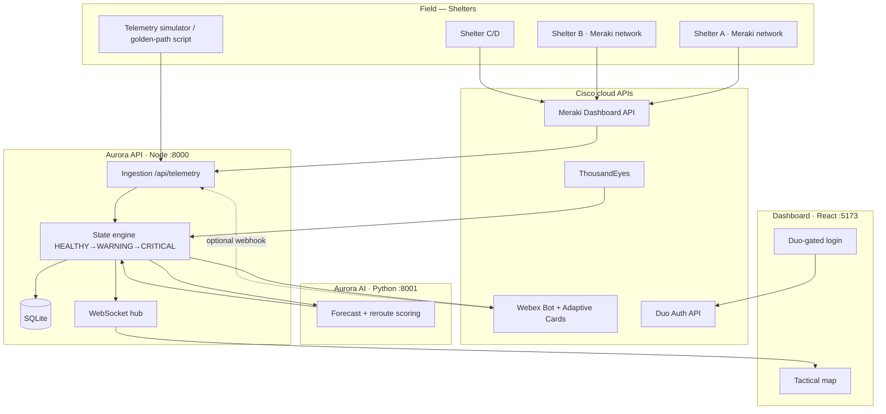
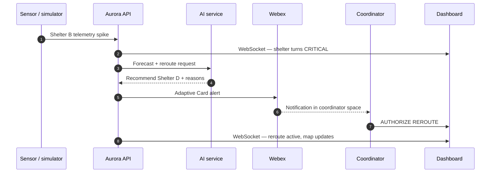
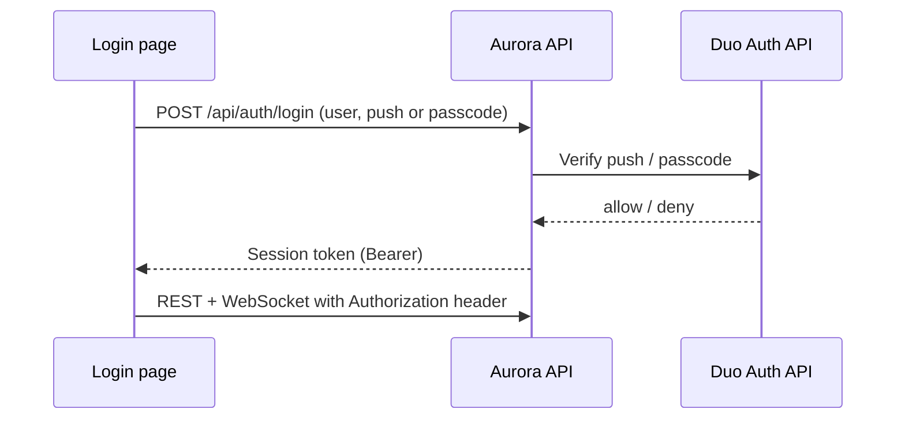
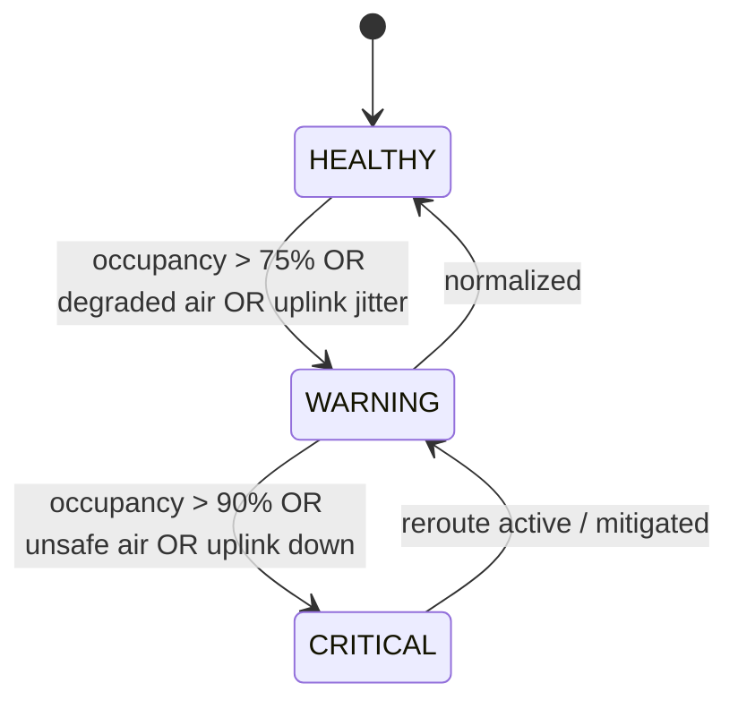

# Aurora — Architecture Diagrams

Concise architecture illustrations for Aurora. 

---

## Diagram 1 — System components (layered architecture)

Major components and Cisco touchpoints.

---

## Diagram 2 — Golden path sequence (crisis workflow)

Core user journey demonstrated in the 5-minute pitch.

---

## Diagram 3 — Authentication flow (Duo MFA)

How coordinator login is secured before dashboard access.

---

## Diagram 4 — Shelter state model

Rules that drive map color and alert severity.

---

## Related documentation

| Document | Purpose |
|----------|---------|
| [ADR.md](../ADR.md) | Why these architectural choices were made |
| [PROJECT.md](../PROJECT.md) | Full problem statement, data model, roadmap |
| [API_CONTRACT.md](../API_CONTRACT.md) | REST/WebSocket integration contract |
